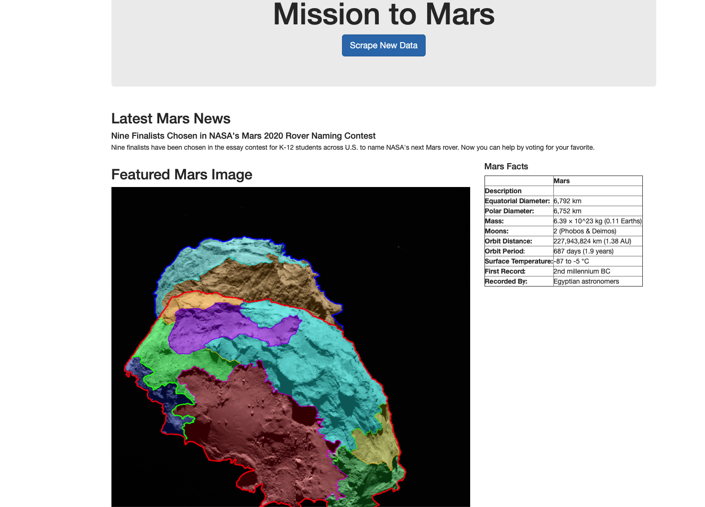

# Overview
Write a python script that scrapes data on the mission to mars and display the findings in a web application. 

Goals:
* Create a python script that loads and scrapes various web pages with information on mars.
* Save scrapped data into a MongoDB.
* Deploy results in a flask web application. (runs on a development server http://127.0.0.1:5000/)
* Add an interactive feature (button) to the web application that scrapes new data when clicked. 

## Tools/ Languages Used: 
* HTML
* CSS
* Python
* BeatifulSoup
* Splinter
* MongoDB
* Flask
* Chrome Driver 

# Visuals

A sample of the webpage that is displayed when the mars_app.py file is ran. 
